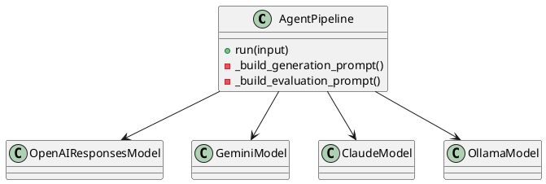

# APIリファレンス

本ページでは、主要なクラス・関数の概要・主な引数・戻り値・役割をまとめます。

## クラス・関数一覧

| 名前                | 種別     | 概要                                             |
|---------------------|----------|--------------------------------------------------|
| get_llm             | 関数     | モデル名・プロバイダー名からLLMインスタンスを取得 |
| AgentPipeline       | クラス   | 生成・評価・ツール・ガードレール統合パイプライン  |
| OpenAIResponsesModel| クラス   | OpenAI用モデルラッパー                           |
| GeminiModel         | クラス   | Google Gemini用モデルラッパー                    |
| ClaudeModel         | クラス   | Anthropic Claude用モデルラッパー                  |
| OllamaModel         | クラス   | Ollama用モデルラッパー                           |

---

## get_llm
- モデル名・プロバイダー名からLLMインスタンスを返すファクトリ関数
- 引数:
    - model (str): モデル名
    - provider (str, optional): プロバイダー名（省略時は自動推論）
- 戻り値: LLMインスタンス

## AgentPipeline
- 生成・評価・ツール・ガードレールを統合したパイプライン管理クラス
- 主な引数:
    - name (str): パイプライン名
    - generation_instructions (str): 生成用プロンプト
    - evaluation_instructions (str, optional): 評価用プロンプト
    - model (str or LLM): 使用するモデル
    - generation_tools (list, optional): 生成時ツール
    - input_guardrails/output_guardrails (list, optional): 入出力ガードレール
    - threshold (int): 評価閾値
    - retries (int): リトライ回数
    - retry_comment_importance (list[str], optional): 重要度指定
- 主なメソッド:
    - run(input): 入力に対して生成・評価・自己改善を実行
- 戻り値: 生成・評価結果

## モデルラッパークラス
| クラス名                | 概要                       |
|------------------------|----------------------------|
| OpenAIResponsesModel   | OpenAI API用               |
| GeminiModel            | Google Gemini API用        |
| ClaudeModel            | Anthropic Claude API用     |
| OllamaModel            | Ollama API用               |

---

## クラス図（PlantUML）
