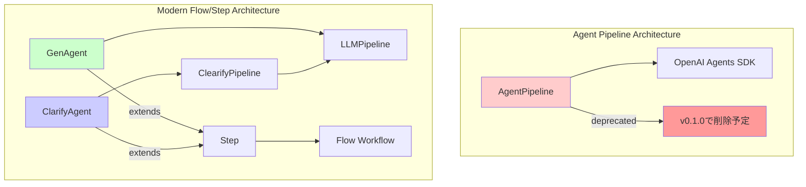

# エージェントクラス比輁E��イチE

## 概要E

agents-sdk-modelsには3つの主要なエージェントクラスがあります！E

- **AgentPipeline** �E�非推奨�E�：従来のオールインワン型パイプライン
- **GenAgent**�E�モダンなチE��スト生成�E変換エージェンチE
- **ClarifyAgent**�E�対話型要件明確化エージェンチE

本斁E��では吁E��ラスのインターフェース、機�E、E��用場面を詳しく比輁E��ます、E

## アーキチE��チャ概要E



## 詳細比輁E��

### 基本属性比輁E

| 頁E�� | AgentPipeline | GenAgent | ClarifyAgent |
|------|---------------|----------|---------------|
| **スチE�Eタス** | 🚨 非推奨�E�E0.1.0で削除�E�E| ✁E推奨 | ✁E推奨 |
| **アーキチE��チャ** | 独立型パイプライン | Flow/Step統吁E| Flow/Step統吁E|
| **冁E��実裁E* | OpenAI Agents SDK直接利用 | LLMPipeline使用 | ClearifyPipeline使用 |
| **対話性** | 単発実衁E| 単発実衁E| 多ターン対話 |
| **主な用送E* | 生�E・評価・改喁E| 生�E・変換 | 要件明確匁E|

### 機�E比輁E

| 機�E | AgentPipeline | GenAgent | ClarifyAgent |
|------|---------------|----------|---------------|
| **チE��スト生戁E* | ✁E| ✁E| ✁E��質問生成！E|
| **品質評価** | ✁E| ✁E| ✁E|
| **リトライ機�E** | ✁E| ✁E| ✁E|
| **構造化�E劁E* | ✁E| ✁E| ✁E|
| **多ターン対話** | ❁E| ❁E| ✁E|
| **要件明確匁E* | ❁E| ❁E| ✁E|
| **ターン制御** | ❁E| ❁E| ✁E|
| **会話状態管琁E* | ❁E| ❁E| ✁E|
| **Flowワークフロー統吁E* | ❌（ラチE��ー忁E��E��E| ✁E| ✁E|

### インターフェース比輁E

#### 作�E関数

| クラス | 基本作�E関数 | 評価付き作�E関数 |
|--------|-------------|------------------|
| AgentPipeline | `AgentPipeline(...)` | 同一コンストラクタ |
| GenAgent | `create_simple_gen_agent(...)` | `create_evaluated_gen_agent(...)` |
| ClarifyAgent | `create_simple_clarify_agent(...)` | `create_evaluated_clarify_agent(...)` |

#### コンストラクタパラメータ

##### 共通パラメータ

| パラメータ | AgentPipeline | GenAgent | ClarifyAgent |
|------------|---------------|----------|---------------|
| `name` | ✁Estr | ✁Estr | ✁Estr |
| `generation_instructions` | ✁Estr | ✁Estr | ✁Estr |
| `evaluation_instructions` | ✁EOptional[str] | ✁EOptional[str] | ✁EOptional[str] |
| `model` | ✁Estr | ✁Estr = "gpt-4o-mini" | ✁Estr |
| `evaluation_model` | ✁EOptional[str] | ✁EOptional[str] | ✁EOptional[str] |
| `threshold` | ✁Eint = 85 | ✁Efloat = 85.0 | ✁Eint = 85 |
| `retries` | ✁Eint = 3 | ✁Eint = 3 | ✁Eint = 3 |

##### 固有パラメータ

**AgentPipeline固朁E*
- `input_guardrails` / `output_guardrails`
- `generation_tools` / `evaluation_tools` 
- `routing_func`
- `session_history` / `history_size`
- `improvement_callback`
- `dynamic_prompt`
- `retry_comment_importance`
- `locale`

**GenAgent固朁E*
- `output_model` (Pydantic)
- `temperature` / `max_tokens` / `timeout`
- `next_step` / `store_result_key`

**ClarifyAgent固朁E*
- `output_data` (ターゲチE��チE�Eタ垁E
- `clerify_max_turns` (最大ターン数)
- `conversation_key` (会話状態キー)

#### 実行メソチE��

| クラス | 同期実衁E| 非同期実衁E| 戻り値 |
|--------|----------|------------|--------|
| AgentPipeline | `run(user_input)` | `run_async(user_input)` | 生�E結果 or None |
| GenAgent | - | `run(user_input, ctx)` | Context |
| ClarifyAgent | - | `run(user_input, ctx)` | Context |

## 使用例比輁E

### 1. 基本皁E��チE��スト生戁E

#### AgentPipeline�E�非推奨�E�E
```python
# 非推奨 - 使用を避ける
pipeline = AgentPipeline(
    name="simple_gen",
    generation_instructions="ユーザーの質問に答えてください、E,
    evaluation_instructions=None,
    model="gpt-4o-mini"
)
result = pipeline.run("人工知能の未来につぁE��教えて")
```

#### GenAgent�E�推奨�E�E
```python
from agents_sdk_models import create_simple_gen_agent, Context
import asyncio

agent = create_simple_gen_agent(
    name="simple_gen",
    instructions="ユーザーの質問に答えてください、E,
    model="gpt-4o-mini"
)

context = Context()
result_context = asyncio.run(agent.run("人工知能の未来について教えて", context))
result = result_context.shared_state.get("simple_gen_result")
```

### 2. 評価付き生�E

#### AgentPipeline�E�非推奨�E�E
```python
# 非推奨
pipeline = AgentPipeline(
    name="evaluated_gen",
    generation_instructions="創造皁E��物語を書ぁE��ください、E,
    evaluation_instructions="創造性と一貫性を評価してください、E,
    model="gpt-4o",
    threshold=80
)
result = pipeline.run("ロボット�E物誁E)
```

#### GenAgent�E�推奨�E�E
```python
from agents_sdk_models import create_evaluated_gen_agent

agent = create_evaluated_gen_agent(
    name="evaluated_gen",
    generation_instructions="創造皁E��物語を書ぁE��ください、E,
    evaluation_instructions="創造性と一貫性を評価してください、E,
    model="gpt-4o",
    threshold=80.0
)

context = Context()
result_context = asyncio.run(agent.run("ロボット�E物誁E, context))
result = result_context.shared_state.get("evaluated_gen_result")
```

### 3. 要件明確匁E

#### ClarifyAgent�E�新機�E�E�E
```python
from agents_sdk_models import create_simple_clarify_agent
from pydantic import BaseModel

class ProjectInfo(BaseModel):
    name: str
    description: str
    deadline: str

agent = create_simple_clarify_agent(
    name="clarifier",
    instructions="プロジェクト情報を�E確化してください、E,
    output_data=ProjectInfo,
    max_turns=5
)

# 多ターン対話による明確匁E
context = Context()
result_context = asyncio.run(agent.run("新しいプロジェクトを始めたい", context))

# 明確化が完亁E��るまで対話を継綁E
while not agent.is_clarification_complete():
    user_response = input("追加惁E��: ")
    result_context = asyncio.run(agent.run(user_response, result_context))

final_result = result_context.shared_state.get("clarifier_result")
```

## 移行ガイチE

### AgentPipelineからGenAgentへの移衁E

#### Before (AgentPipeline)
```python
pipeline = AgentPipeline(
    name="content_generator",
    generation_instructions="記事を生�Eしてください、E,
    evaluation_instructions="品質を評価してください、E,
    model="gpt-4o",
    threshold=85,
    retries=3
)
result = pipeline.run("AIにつぁE��の記亁E)
```

#### After (GenAgent)
```python
from agents_sdk_models import create_evaluated_gen_agent, Flow

# Step 1: GenAgentに変換
agent = create_evaluated_gen_agent(
    name="content_generator",
    generation_instructions="記事を生�Eしてください、E,
    evaluation_instructions="品質を評価してください、E,
    model="gpt-4o",
    threshold=85.0,
    retries=3
)

# Step 2: Flowで実行（単体また�Eワークフローの一部として�E�E
flow = Flow("content_generation", steps={"generator": agent})
result = asyncio.run(flow.run("AIにつぁE��の記亁E))
content = result.shared_state.get("content_generator_result")
```

## 適用場面別推奨事頁E

### 1. 単純なチE��スト生成�E変換
**推奨**: GenAgent
- 琁E��: モダンなアーキチE��チャ、Flow統合、簡潔なAPI

### 2. 品質保証が重要な生�E
**推奨**: GenAgent�E�評価付き�E�E
- 琁E��: 柔軟な評価設定、改喁E��れたリトライ機�E

### 3. 曖昧な要求�E明確匁E
**推奨**: ClarifyAgent
- 琁E��: 専用設計、多ターン対話、構造化データ収集

### 4. 褁E��なワークフロー
**推奨**: GenAgent + ClarifyAgent をFlowで絁E��合わぁE
- 琁E��: スチE��プ�E絁E��合わせ、柔軟な制御フロー

### 5. 既存�EAgentPipelineコーチE
**対忁E*: 早急にGenAgentに移衁E
- 琁E��: AgentPipelineはv0.1.0で削除予宁E

## ベスト�EラクチE��ス

### 1. GenAgent使用晁E
```python
# ✁E推奨: Factory関数を使用
agent = create_simple_gen_agent(
    name="my_agent",
    instructions="...",
    model="gpt-4o-mini"
)

# ❁E非推奨: 直接コンストラクタ呼び出し（褁E���E�E
agent = GenAgent(
    name="my_agent",
    generation_instructions="...",
    model="gpt-4o-mini",
    # 多くのパラメータ...
)
```

### 2. ClarifyAgent使用晁E
```python
# ✁E推奨: 明確なチE�EタモチE��定義
class UserRequirement(BaseModel):
    goal: str
    constraints: List[str]
    deadline: str

agent = create_simple_clarify_agent(
    name="clarifier",
    instructions="要件を�E確化してください、E,
    output_data=UserRequirement,
    max_turns=10
)
```

### 3. Flow統合時
```python
# ✁E推奨: 役割を�E確に刁E��
clarify_agent = create_simple_clarify_agent(...)
gen_agent = create_evaluated_gen_agent(...)

flow = Flow("complete_workflow", steps={
    "clarify": clarify_agent,
    "generate": gen_agent
})
```

## 性能比輁E

| 頁E�� | AgentPipeline | GenAgent | ClarifyAgent |
|------|---------------|----------|---------------|
| **初期化速度** | 中 | 髁E| 髁E|
| **実行速度** | 中 | 髁E| 中�E�対話型！E|
| **メモリ使用釁E* | 中 | 佁E| 中 |
| **拡張性** | 佁E| 髁E| 髁E|
| **保守性** | 佁E| 髁E| 髁E|

## まとめE

- **AgentPipeline**: 非推奨、早急に移行が忁E��E
- **GenAgent**: モダンな生�E・変換タスク用、E��性能で拡張性が高い
- **ClarifyAgent**: 要件明確化専用、対話型タスクに最適

新規開発では**GenAgent**と**ClarifyAgent**を絁E��合わせたFlow/StepアーキチE��チャの採用を強く推奨します、E
